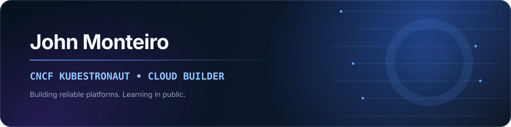

<br />

[](https://git.io/typing-svg)

## `whoami`

I work where cloud infrastructure, automation, and platform engineering meet. I enjoy making complex systems easier to operate and sharing what I learn along the way.

```yaml
apiVersion: cncf.io/v1
kind: Kubestronaut
metadata:
  name: john-monteiro
  labels:
    focus: platform-engineering
spec:
  mission: Build reliable cloud platforms
  mindset:
    - always-learning
    - always-building
  status: exploring-cloud-native
```

<p>
  
  
</p>

---

<a href="https://www.linkedin.com/in/monteiro-john/">
  
</a>

<!--
JohnMonteir0/JohnMonteir0 is a special repository: this README appears on the GitHub profile.
-->
